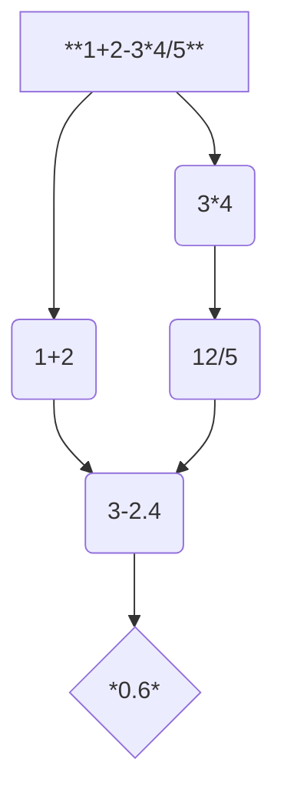
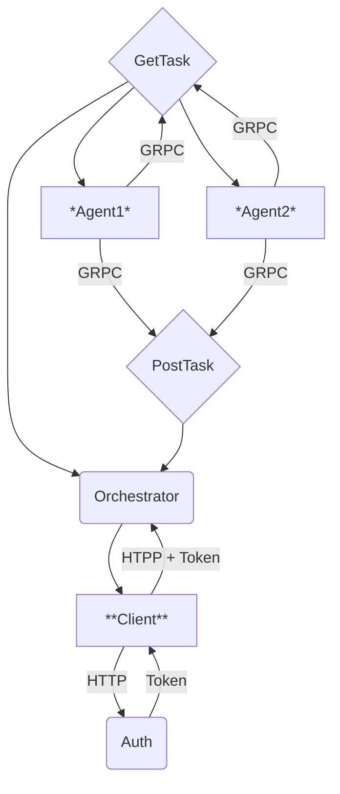

# Многопользовательский распределённый вычислитель арифметических выражений
Это калькулятор, выполняющий классические математические операции, например, +, -, *, /. В основе его создания стоят:
1. Персистентность - возможность программы восстанавливать свое состояние после перезагрузки.
2. Многопользовательский режим - возможность вычислять несколько выражений у разных пользователей.
3. Rest Api - архитектурный стиль взаимодействия компонентов распределенной системы, используется для передачи данных между сервером и пользователем.
4. GRPC - система удаленного вызова процедур, используется для вычисления задач, которые получаются в результате разделения выражения на операции.
## Схемы
### Схема разделения выражения


### Схема работы приложения

## Установка
1. Установите язык программирования [Golang](https://go.dev/dl/).
2. Установите текстовый редактор [Visual Studio Code](https://code.visualstudio.com/).
3. Установите систему контроля версий [Git](https://git-scm.com/downloads).
4. Создайте папку и откройте ее в Visual Studio Code.
5. В проекте слева нажмите на 4 квадратика - Extensions. В поле поиска введите go и скачайте первый модуль под названием Go.
6. Создайте клон репозитория с GitHub. Для этого в терминале Visual Studio Code введите следующую команду:
```
git clone https://github.com/kingofhandsomes/calculator-go
```
7. Зарегистрируйтесь и установите [Postman](https://www.postman.com/).
## Запуск приложения
1. Установите дополнительные пакеты:
```
go mod tidy
```
2. Пересоздайте базу данных:
```
go run storage/init/main.go
```
> [!TIP]
> Может возникнуть ошибка с gcc, для её решения установите и поместите его в системные переменные компьютера
3. Установите необходимую конфигурацию. По пути 'config/local.yaml' находится файл, в котором присутствуют следующие переменные:
- env - происхождение конфигурации;
- storage_path - путь, по которому находится хранилище данных;
- token_ttl - длительность jwt токена;
- TIME_ADDITION_MS - длительность вычисления сложения;
- TIME_SUBTRACTION_MS - длительность вычисления вычитания;
- TIME_MULTIPLICATIONS_MS - длительность вычисления умножения;
- TIME_DIVISIONS_MS - длительность вычисления деления;
- COMPUTING_POWER - количество агентов, которые будут асинхронно вычислять задачи;
- port - порт для Rest Api, то есть для работы пользователя с сервером;
- grpc_port - порт для gRPC, то есть для работы агентов с сервером;
4. Запустите приложение:
```
go run cmd/calculator/main.go --config="./config/local.yaml"
```
## Работа пользователя с сервером
1. Аутентификация (Регистрация):    

2. Авторизация (Вход):
