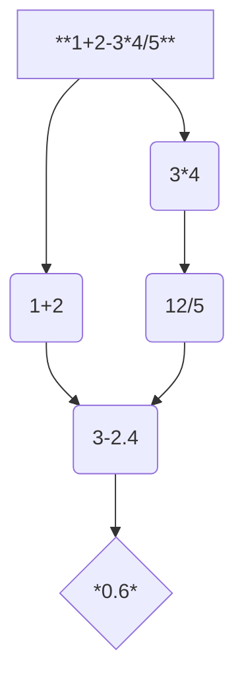
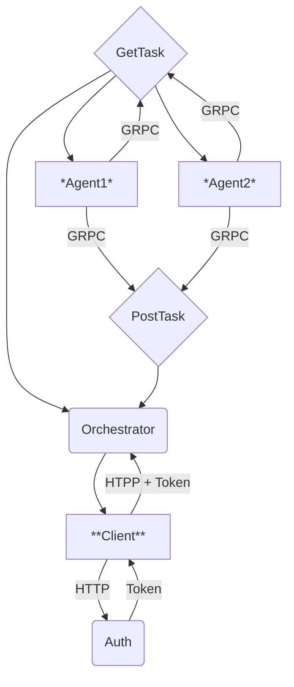

# Многопользовательский распределённый вычислитель арифметических выражений
Это калькулятор, выполняющий классические математические операции, например, +, -, *, /. В основе его создания стоят:
1. Персистентность - возможность программы восстанавливать свое состояние после перезагрузки.
2. Многопользовательский режим - возможность вычислять несколько выражений у разных пользователей.
3. Rest Api - архитектурный стиль взаимодействия компонентов распределенной системы, используется для передачи данных между сервером и пользователем.
4. GRPC - система удаленного вызова процедур, используется для вычисления задач, которые получаются в результате разделения выражения на операции.
## Схемы
### Схема разделения выражения


### Схема работы приложения

## Установка
1. Установите язык программирования [Golang](https://go.dev/dl/).
2. Установите текстовый редактор [Visual Studio Code](https://code.visualstudio.com/).
3. Установите систему контроля версий [Git](https://git-scm.com/downloads).
4. Создайте папку и откройте ее в Visual Studio Code.
5. В проекте слева нажмите на 4 квадратика - Extensions. В поле поиска введите go и скачайте первый модуль под названием Go.
6. Создайте клон репозитория с GitHub. Для этого в терминале Visual Studio Code введите следующую команду:
```
git clone https://github.com/kingofhandsomes/calculator-go
cd calculator-go
```
7. Зарегистрируйтесь и установите [Postman](https://www.postman.com/).
## Запуск приложения
1. Установите дополнительные пакеты:
```
go mod tidy
```
2. Пересоздайте базу данных:
```
go run storage/init/main.go
```
> [!TIP]
> Может возникнуть ошибка с gcc, для её решения установите и поместите его в системные переменные компьютера
3. Установите необходимую конфигурацию. По пути 'config/local.yaml' находится файл, в котором присутствуют следующие переменные:
- env - происхождение конфигурации;
- storage_path - путь, по которому находится хранилище данных;
- token_ttl - длительность jwt токена;
- TIME_ADDITION_MS - длительность вычисления сложения;
- TIME_SUBTRACTION_MS - длительность вычисления вычитания;
- TIME_MULTIPLICATIONS_MS - длительность вычисления умножения;
- TIME_DIVISIONS_MS - длительность вычисления деления;
- COMPUTING_POWER - количество агентов, которые будут асинхронно вычислять задачи;
- port - порт для Rest Api, то есть для работы пользователя с сервером;
- grpc_port - порт для gRPC, то есть для работы агентов с сервером.
4. Запустите приложение:
```
go run cmd/calculator/main.go --config="./config/local.yaml"
```
## Работа пользователя с сервером
1. **Регистрация:**  

2. **Вход (аутентификация):**  
  
*Получаем токен. Для последующих запросов вставляем его в Headers - Authorization:*  
  
> [!TIP]
> Данный токен содержит в себе ваши данные, срок его действия и является проводником для работы с оркестратором.
3. **Отправка выражения на вычисление:**  

4. **Вывод всех выражений:**  

5. **Вывод одного выражения:**

## Работа агентов с сервером
Для этого используется gRPC, создается сервер и клиент, в качестве сервера выступает оркестратор, в качестве клиента - агенты, которые получают задачи и асинхронно выполняют их. Пользователь не может выступать клиентом. Запросы:
- Запрос на получение задачи:  

- Запрос на отправку решения задачи:

## Вывод ошибок
1. **Register**
- *пустые поля login или password:*  


- *повторная отправка такого же login:*  

- *неверная json структура запроса:*

2. **Login**
- *пустые поля login или password:*


- *неверный password:*  

- *неверный login:*

- *неверная json структура запроса:*  

3. **Calculate**
- *неверный токен:*  

- *время действия токена истекло:*  

- *неверное выражение:*  

- *неверная json структура запроса:*  

4. **Expressions**
- *неверный токен:*  

- *время действия токена истекло:*  

5. **Expression**
- *неверный токен:*  

- *время действия токена истекло:*  

- *неверный id выражения:*

## Тесты
**Запуск тестов по отдельности:**
- *модульные:*
```
go test ./internal/transport/auth/test/auth_test.go
go test ./internal/transport/orchestrator/test/orchestrator_test.go
```
- *интеграционные:*
```
go test ./internal/app/test/app_test.go
```
**Запуск всех тестов сразу:**
```
go test ./...
```
## Связь с разработчиком
*Телеграмм:* **@KinGofHanDSomEs**
